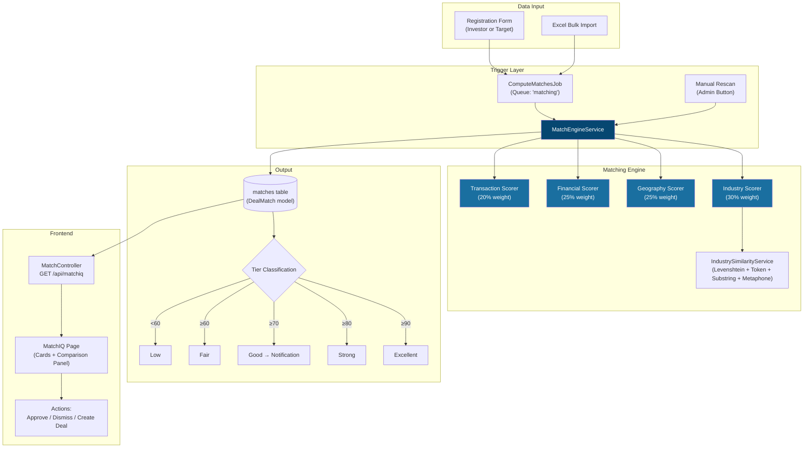
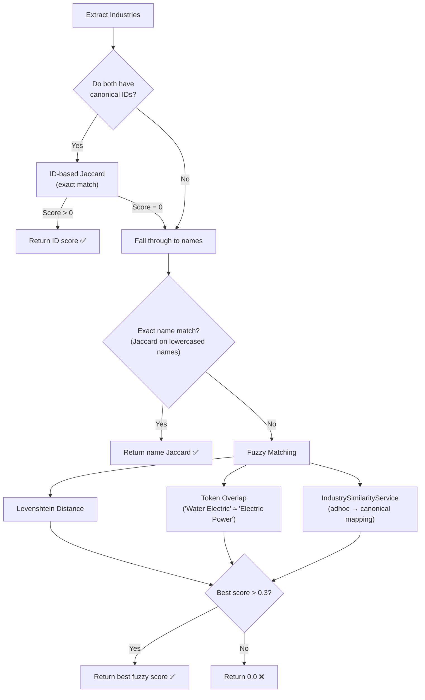
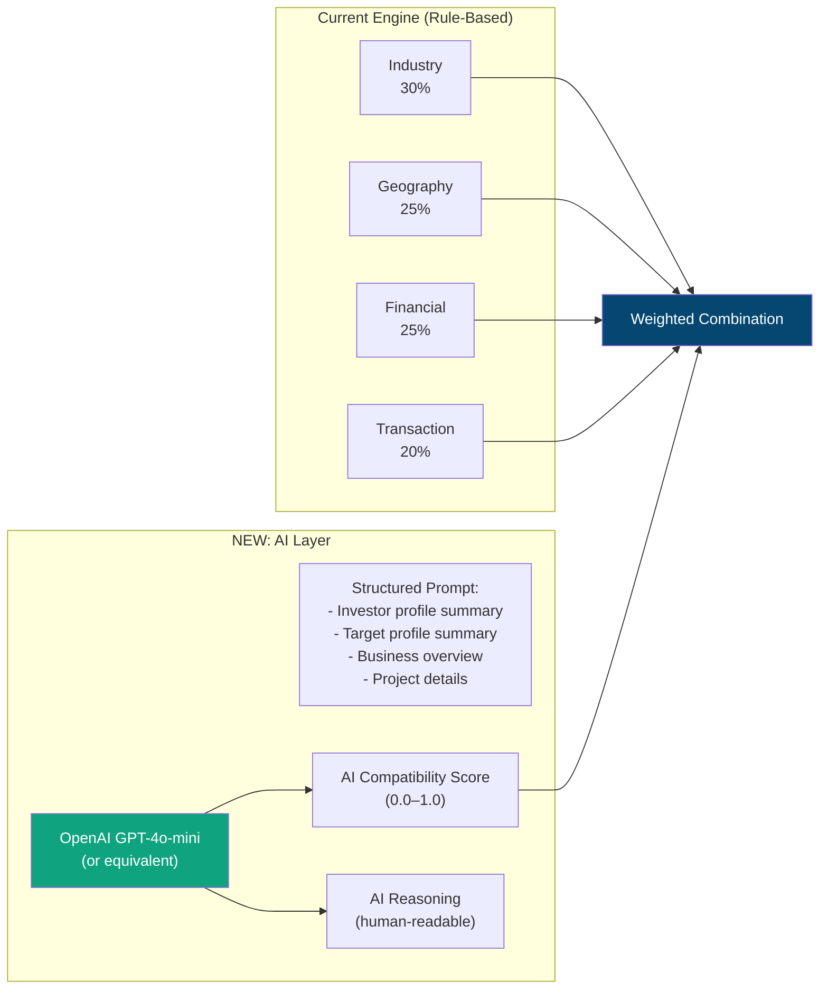
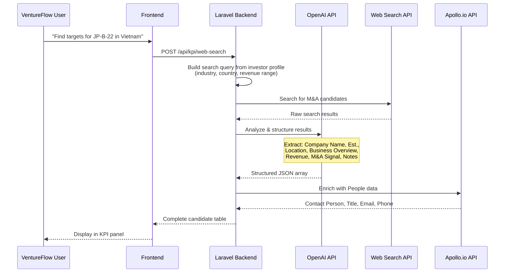
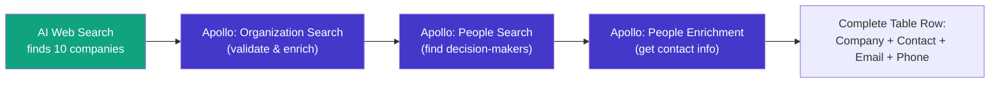
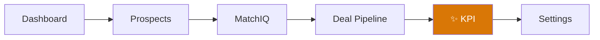
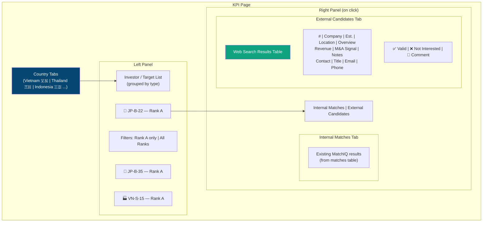

# MatchIQ — Architecture, Engine & KPI Feature Plan

> **Status:** Planning Document — No implementations yet  
> **Last Updated:** 2026-03-03

---

## Table of Contents

1. [Current MatchIQ Architecture](#1-current-matchiq-architecture)
2. [How the Scoring Engine Works](#2-how-the-scoring-engine-works)
3. [Phase 1 — AI-Enhanced Matching](#3-phase-1--ai-enhanced-matching)
4. [Phase 2 — Web Intelligence Search](#4-phase-2--web-intelligence-search)
5. [Phase 3 — Apollo.io Contact Enrichment](#5-phase-3--apolloio-contact-enrichment)
6. [Phase 4 — KPI Feature](#6-phase-4--kpi-feature)
7. [Data Model Changes](#7-data-model-changes)
8. [API Cost Estimates](#8-api-cost-estimates)

---

## 1. Current MatchIQ Architecture

### System Overview



### File Map

| Component  | File                                                                                                                                                       | Purpose                                                       |
| ---------- | ---------------------------------------------------------------------------------------------------------------------------------------------------------- | ------------------------------------------------------------- |
| Engine     | [MatchEngineService.php](file:///c:/Code%20Projects/VentureFlow/VentureFlow%20Codes/ventureflow-backend/app/Services/MatchEngineService.php)               | Scores every Investor ↔ Target pair                           |
| Similarity | [IndustrySimilarityService.php](file:///c:/Code%20Projects/VentureFlow/VentureFlow%20Codes/ventureflow-backend/app/Services/IndustrySimilarityService.php) | Fuzzy industry name matching                                  |
| Job        | [ComputeMatchesJob.php](file:///c:/Code%20Projects/VentureFlow/VentureFlow%20Codes/ventureflow-backend/app/Jobs/ComputeMatchesJob.php)                     | Async queue worker (3 retries, 120s timeout)                  |
| Model      | [DealMatch.php](file:///c:/Code%20Projects/VentureFlow/VentureFlow%20Codes/ventureflow-backend/app/Models/DealMatch.php)                                   | Eloquent model for `matches` table                            |
| Controller | [MatchController.php](file:///c:/Code%20Projects/VentureFlow/VentureFlow%20Codes/ventureflow-backend/app/Http/Controllers/MatchController.php)             | REST API (index, show, rescan, approve, dismiss, create-deal) |
| Frontend   | [MatchIQ.tsx](file:///c:/Code%20Projects/VentureFlow/VentureFlow%20Codes/ventureflow-frontend/src/pages/matching/MatchIQ.tsx)                              | Main page with cards, stats bar, filters                      |

### Current Data Flow

1. **Trigger**: New investor/target registration or import → dispatches [ComputeMatchesJob](file:///c:/Code%20Projects/VentureFlow/VentureFlow%20Codes/ventureflow-backend/app/Jobs/ComputeMatchesJob.php#28-105) to the `matching` queue
2. **Scoring**: Engine loads ALL active entities on the opposite side and scores each pair
3. **Storage**: Pairs scoring ≥ 30 (MIN_SCORE) are upserted into the `matches` table
4. **Notification**: Matches scoring ≥ 70 trigger push notifications to all users
5. **Frontend**: MatchIQ page fetches matches, clusters by investor, shows comparison panel on click

---

## 2. How the Scoring Engine Works

### The 4 Weighted Dimensions

Each dimension returns a score between `0.0` and `1.0`. The weighted combination produces a final score `0–100`.

#### Formula

```
total_score = round(
  (industry × 0.30) +
  (geography × 0.25) +
  (financial × 0.25) +
  (transaction × 0.20)
) × 100
```

---

### Dimension 1: Industry Match (30%)

Compares investor's **preferred industries** against target's **actual industries**.



**Data Sources:**
- **Investor**: `company_overview.main_industry_operations` + `company_overview.company_industry`
- **Target**: `company_overview.industry_ops`

---

### Dimension 2: Geography Match (25%)

Binary check — is the target's HQ country in the investor's list of target countries?

| Scenario | Score |
|----------|-------|
| Target HQ in investor's target countries | **1.0** |
| Not in list | **0.0** |

**Data Sources:**
- **Investor**: `company_overview.target_countries` (JSON array of country objects/IDs)
- **Target**: `company_overview.hq_country`

---

### Dimension 3: Financial Fit (25%)

Compares **investor's budget range** vs **target's expected investment amount**, both normalized to **USD** using the `currencies` table.

| Scenario | Score |
|----------|-------|
| Target range fits perfectly inside investor budget | **1.0** |
| Partial overlap | **0.7** |
| No overlap — logarithmic proximity curve | **0.0–0.4** |

**Data Sources:**
- **Investor**: `company_overview.investment_budget` (JSON `{min, max}`) + `financial_details.default_currency`
- **Target**: `financial_details.expected_investment_amount` (JSON `{min, max}`) + `financial_details.default_currency`

---

### Dimension 4: Transaction Fit (20%)

Combined from two sub-scorers:

| Sub-dimension | Weight | What it checks |
|---------------|--------|---------------|
| **Ownership Structure** | 60% | `investment_condition` compatibility (majority/minority/flexible) |
| **M&A Purpose** | 40% | `reason_ma` cross-matched against a compatibility matrix |

**Purpose Compatibility Matrix:**

| Investor Purpose | Compatible Target Reasons |
|-------------|--------------------------|
| Strategic Expansion | Strategic partnership, Market expansion, Growth acceleration |
| Market Entry | Market expansion, Cross-border expansion, Strategic partnership |
| Financial Investment | Full exit, Partial exit, Capital raising, Owner's retirement, Business succession |
| Technology Acquisition | Technology integration, Strategic partnership |
| Diversification | Non-core divestment, Market expansion, Technology integration |
| Talent Acquisition | Strategic partnership, Growth acceleration |

---

## 3. Phase 1 — AI-Enhanced Matching

### What Changes

Currently, matching is purely rule-based (if-then scoring). AI would add a **5th dimension** — a semantic understanding layer that reads profiles holistically.

### Architecture



### Revised Weights (with AI)

| Dimension | Current Weight | New Weight |
|-----------|---------------|------------|
| Industry | 30% | 25% |
| Geography | 25% | 20% |
| Financial | 25% | 20% |
| Transaction | 20% | 15% |
| **AI Semantic** | — | **20%** |

### What AI Would Analyze

For each Investor ↔ Target pair, the AI receives a **structured prompt** containing:

1. **Investor Profile**: Company name, industry, target regions, investment budget, ownership preferences, M&A purpose, company overview text
2. **Target Profile**: Company name, industry, HQ country, revenue range, investment ask, EBITDA, ownership structure, reason for M&A, company overview text
3. **Question**: "Rate the strategic compatibility of this investor-target pair on a 0–100 scale. Explain your reasoning in 2–3 sentences."

### Implementation Approach

| Item | Details |
|------|---------|
| **API** | OpenAI Chat Completions (`gpt-4o-mini` for cost efficiency) |
| **Cost** | ~$0.15/1M input tokens, ~$0.60/1M output tokens → ~$0.001 per pair |
| **Rate Limit** | Batch API calls; run as background job, max 50 pairs/minute |
| **Caching** | Cache AI scores for 7 days; invalidate when either profile updates |
| **Fallback** | If AI API fails, use rule-based score only (graceful degradation) |
| **New DB Column** | `matches.ai_score FLOAT`, `matches.ai_reasoning TEXT` |

> [!IMPORTANT]
> AI scoring would be **additive** — the rule-based engine always runs. AI enhances but never blocks matching.

---

## 4. Phase 2 — Web Intelligence Search

### Concept

An AI-powered feature that **searches the web** for potential M&A candidates matching an investor's criteria, returning structured company intelligence.

### Architecture



### Web Search API Options

| Provider | Strengths | Cost |
|----------|-----------|------|
| **Serper.dev** | Google Search results as JSON | $50/mo for 50K searches |
| **SerpAPI** | Google, Bing, Yahoo | $50/mo for 5K searches |
| **Tavily** | AI-optimized search, built for LLM | $100/mo for 1K searches |
| **Brave Search API** | Privacy-focused, good for company data | Free tier (2K/mo) |

### Recommended Approach

1. Use **Serper.dev** or **Brave Search** for raw web results (cost-effective)
2. Use **OpenAI** to parse and structure the results into the target table format
3. Use **Apollo.io** to enrich with contact information (separate phase)

### Output Table Schema

```
#, Company Name, Est., Location, Business Overview, Revenue Est. (USD),
Japanese Connection, M&A Signal, Notes & Priority
```

The AI prompt would instruct the model to:
- Search for companies matching the investor's industry preferences + target country
- Estimate revenue from public data
- Detect any Japanese connections (partnerships, ownership, prior deals)
- Assess M&A signal strength (ownership structure, succession planning, growth stage)
- Generate prioritized notes

---

## 5. Phase 3 — Apollo.io Contact Enrichment

### API Endpoints to Use

| Endpoint | Purpose | Credits |
|----------|---------|---------|
| **Organization Search** | Find companies by name, location, industry, revenue | ✅ Consumes credits |
| **Organization Enrichment** | Get revenue, employees, funding, industry for 1 company | ✅ Consumes credits |
| **People Search** | Find people at a company (name, title) | ❌ Free (no email/phone) |
| **People Enrichment** | Get email + phone for a specific person | ✅ Consumes credits |

### Data Flow



### Extended Table Schema (After Apollo Enrichment)

```
#, Company Name, Est., Location, Business Overview, Revenue Est. (USD),
Japanese Connection, M&A Signal, Notes & Priority,
Contact Person, Title, Email, Phone
```

### Credit Usage Estimate

| Action | Credits per company | For 10 companies |
|--------|-------------------|-------------------|
| Organization Search | 1 | 10 |
| Organization Enrichment | 1 | 10 |
| People Search | 0 (free) | 0 |
| People Enrichment | 1 per person | 10–20 |
| **Total per search** | — | **~30-40 credits** |

---

## 6. Phase 4 — KPI Feature

### What is KPI?

**KPI** (Key Prospect Intelligence) is a **day-to-day operational tool** for the M&A team. It organizes potential targets by **country**, surfaces both **internal matches** (from existing MatchIQ) and **external candidates** (from web search), and lets users **triage, annotate, and save** prospects.

### Navigation Placement



KPI sits **after Deal Pipeline** in the sidebar, with its own icon.

### UI Architecture



### Core User Workflow

1. **Select Country** → Vietnam tab
2. **See all Rank A investors and targets** in the left panel
3. **Click on an investor** (e.g., JP-B-22) → right panel opens
4. **Two tabs appear**:
   - **Internal Matches**: Existing targets from MatchIQ with scores
   - **External Candidates**: Web-discovered companies (initially empty until a search is run)
5. **Run Web Search** → AI searches for companies matching this investor's criteria
6. **Apollo enriches** contacts automatically
7. **Review results** → Mark each candidate as:
   - ✅ **Valid** — good fit, save for follow-up
   - ❌ **Not Interested** — dismiss
   - 💬 **Add Comment** — notes for the team
8. **Saved candidates** are stored as **External Candidates** linked to that investor

### KPI Data Persistence

External candidates are saved permanently and can be:
- Revisited at any time under the investor's KPI panel
- Converted to a registered Target (if the team decides to pursue)
- Exported to Excel
- Shared with partners (based on sharing settings)

---

## 7. Data Model Changes

### New Tables

#### `external_candidates`

| Column | Type | Description |
|--------|------|-------------|
| [id](file:///c:/Code%20Projects/VentureFlow/VentureFlow%20Codes/ventureflow-frontend/src/components/Sidebar.tsx#22-309) | BIGINT PK | Auto-increment |
| `investor_id` | FK → investors | Which investor this candidate is for |
| `company_name` | VARCHAR(255) | Company name |
| `established_year` | INT | Year established |
| `location` | VARCHAR(255) | City/Country |
| `business_overview` | TEXT | What the company does |
| `revenue_estimate` | VARCHAR(100) | Revenue range string |
| `japanese_connection` | VARCHAR(255) | Detected Japanese ties |
| `ma_signal` | VARCHAR(50) | MODERATE / HIGH / NONE |
| `notes` | TEXT | AI-generated notes |
| `contact_person` | VARCHAR(255) | Decision-maker name |
| `contact_title` | VARCHAR(255) | Title (CEO, MD, etc.) |
| `contact_email` | VARCHAR(255) | From Apollo enrichment |
| `contact_phone` | VARCHAR(100) | From Apollo enrichment |
| `status` | ENUM | `pending` / `valid` / `not_interested` |
| `user_comment` | TEXT | Team member comments |
| `reviewed_by` | FK → users | Who reviewed this candidate |
| `source` | VARCHAR(50) | `web_search` / `manual` |
| `apollo_org_id` | VARCHAR(100) | Apollo organization ID (for re-enrichment) |
| `search_country` | VARCHAR(100) | Country context of the search |
| `created_at` | TIMESTAMP | |
| `updated_at` | TIMESTAMP | |

#### `matches` table changes

| New Column | Type | Description |
|------------|------|-------------|
| `ai_score` | FLOAT | AI semantic compatibility score |
| `ai_reasoning` | TEXT | AI-generated explanation |

### New API Endpoints

| Method | Endpoint | Description |
|--------|----------|-------------|
| GET | `/api/kpi/countries` | List countries with Rank A prospect counts |
| GET | `/api/kpi/prospects?country=VN` | List Rank A investors/targets for a country |
| GET | `/api/kpi/investor/{id}/matches` | Internal matches for an investor |
| GET | `/api/kpi/investor/{id}/candidates` | Saved external candidates |
| POST | `/api/kpi/investor/{id}/web-search` | Trigger AI web search |
| PATCH | `/api/kpi/candidates/{id}` | Update status/comment |
| POST | `/api/kpi/candidates/{id}/convert` | Convert to registered Target |

---

## 8. API Cost Estimates

### Monthly Cost Projection

Assuming 50 web searches/month, 10 candidates per search:

| Service | Usage | Cost/mo |
|---------|-------|---------|
| **OpenAI GPT-4o-mini** (AI matching) | ~500 pairs × 2 prompts | ~$2–5 |
| **OpenAI GPT-4o-mini** (Web intelligence) | ~50 searches × 1 prompt | ~$1–3 |
| **Serper.dev** (Web search) | ~100 queries | ~$5 (starter plan) |
| **Apollo.io** (Organization + People) | ~1,500 credits | Depends on plan |
| **Total estimate** | — | **~$10–15/mo + Apollo plan** |

> [!TIP]
> Start with `gpt-4o-mini` for cost efficiency. Upgrade to `gpt-4o` only if match quality is insufficient.

---

## Implementation Roadmap

| Phase | Feature | Effort | Dependencies |
|-------|---------|--------|-------------|
| **1** | AI-Enhanced Matching | 3–4 days | OpenAI API key |
| **2** | Web Intelligence Search | 4–5 days | Phase 1 + Serper API key |
| **3** | Apollo.io Enrichment | 2–3 days | Phase 2 + Apollo API key |
| **4** | KPI Feature (full UI) | 5–7 days | Phases 1–3 |
| **Total** | | **~15–20 days** | |

> [!CAUTION]
> Phases are sequential. Each phase builds on the previous. AI matching (Phase 1) should be validated before investing in web search infrastructure.
