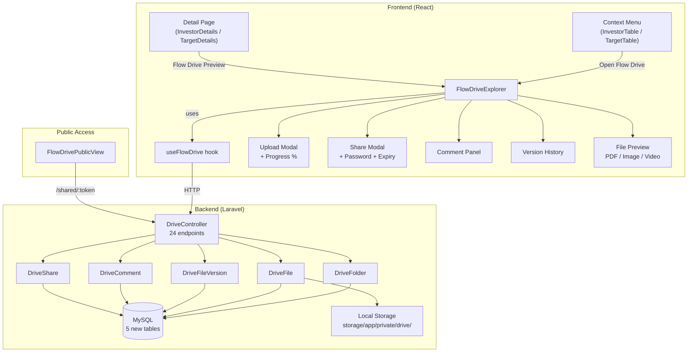

# Flow Drive — File & Folder Management System (Revised Plan)

A Google Drive-like file/folder system for each prospect, accessible via right-click "Open Flow Drive" and from within the prospect's profile page. **Partners are completely blocked from this feature.**

---

## Key Decisions (From Your Review)

| # | Decision | Resolution |
|---|----------|------------|
| 1 | **Name** | "Flow Drive" everywhere — context menu, detail pages, breadcrumbs, share pages |
| 2 | **Build approach** | 100% from scratch, React + Lucide. Only `react-dropzone` for drag-and-drop |
| 3 | **Existing vs new prospects** | All prospects (old + new) get Flow Drive automatically — the Drive is lazily created on first access |
| 4 | **Breadcrumbs** | Reuse the existing `Header.tsx` Premium Breadcrumbs — just add `'drive'` to the translation map |
| 5 | **Partner access** | Completely blocked — no menu option, no detail section, no routes. Only shared links work |
| 6 | **Previous dev's tables** | Build **fresh migrations** — don't extend their incomplete `folders`/`files`/`file_folders` tables |
| 7 | **File preview** | Open PDFs, images, and office docs in-browser (not just download) |
| 8 | **File comments** | Right-click → "Add Comment" — comments stored per file with user info + timestamp |
| 9 | **Version control** | Re-upload detection: "Replace existing?" prompt → version history with datetime + user avatar |
| 10 | **Sharing security** | Password protection, time-sensitive expiry, rate limiting, token rotation, audit logging |
| 11 | **Upload progress** | Per-file percentage bar, chunked uploads for large files, cancel per-file |
| 12 | **Git strategy** | No commit/push until core features are verified working locally |

---

## Proposed Changes

### 1. Backend — Fresh Database Schema

> [!IMPORTANT]
> We are creating **new tables** (`drive_folders`, `drive_files`, `drive_file_versions`, `drive_comments`, `drive_shares`) instead of modifying the previous developer's incomplete `folders`/`files`/`file_folders` tables. Those old tables remain untouched — **zero risk of hallucination** from building on broken foundations.

---

#### [NEW] Migration: `create_drive_folders_table`

```php
Schema::create('drive_folders', function (Blueprint $table) {
    $table->uuid('id')->primary();
    $table->string('name');
    $table->uuid('parent_id')->nullable();              // Self-ref for nesting
    $table->foreign('parent_id')->references('id')->on('drive_folders')->onDelete('cascade');
    $table->enum('prospect_type', ['investor', 'target']);
    $table->unsignedBigInteger('prospect_id');           // seller.id or buyer.id
    $table->foreignId('created_by')->constrained('users');
    $table->timestamps();
    
    $table->index(['prospect_type', 'prospect_id']);     // Fast lookup per prospect
    $table->index(['parent_id']);                         // Fast folder tree traversal
});
```

#### [NEW] Migration: `create_drive_files_table`

```php
Schema::create('drive_files', function (Blueprint $table) {
    $table->uuid('id')->primary();
    $table->string('original_name');                     // User-facing filename
    $table->string('storage_path');                      // Internal path on disk
    $table->string('mime_type')->nullable();
    $table->unsignedBigInteger('size')->default(0);      // Bytes
    $table->uuid('folder_id')->nullable();               // null = root level
    $table->foreign('folder_id')->references('id')->on('drive_folders')->onDelete('cascade');
    $table->enum('prospect_type', ['investor', 'target']);
    $table->unsignedBigInteger('prospect_id');
    $table->unsignedInteger('version')->default(1);      // Current version number
    $table->foreignId('uploaded_by')->constrained('users');
    $table->timestamps();
    
    $table->index(['prospect_type', 'prospect_id']);
    $table->index(['folder_id']);
});
```

#### [NEW] Migration: `create_drive_file_versions_table`

```php
// Tracks every version when a file is replaced
Schema::create('drive_file_versions', function (Blueprint $table) {
    $table->uuid('id')->primary();
    $table->uuid('file_id');
    $table->foreign('file_id')->references('id')->on('drive_files')->onDelete('cascade');
    $table->unsignedInteger('version_number');           // 1, 2, 3...
    $table->string('storage_path');                      // Path to this version's file
    $table->unsignedBigInteger('size')->default(0);
    $table->string('mime_type')->nullable();
    $table->foreignId('uploaded_by')->constrained('users');
    $table->timestamps();                                // created_at = when this version was uploaded
});
```

#### [NEW] Migration: `create_drive_comments_table`

```php
Schema::create('drive_comments', function (Blueprint $table) {
    $table->uuid('id')->primary();
    $table->uuid('file_id');
    $table->foreign('file_id')->references('id')->on('drive_files')->onDelete('cascade');
    $table->text('content');
    $table->foreignId('user_id')->constrained('users');
    $table->timestamps();                                // created_at, updated_at
});
```

#### [NEW] Migration: `create_drive_shares_table`

```php
Schema::create('drive_shares', function (Blueprint $table) {
    $table->uuid('id')->primary();
    $table->uuid('file_id')->nullable();
    $table->uuid('folder_id')->nullable();
    $table->foreign('file_id')->references('id')->on('drive_files')->onDelete('cascade');
    $table->foreign('folder_id')->references('id')->on('drive_folders')->onDelete('cascade');
    $table->string('share_token', 64)->unique();         // Crypto-random URL-safe token
    $table->string('password_hash')->nullable();          // bcrypt — null = no password
    $table->timestamp('expires_at')->nullable();          // null = never expires
    $table->boolean('is_active')->default(true);          // Can be deactivated
    $table->unsignedInteger('access_count')->default(0);  // Track usage
    $table->unsignedInteger('max_access_count')->nullable(); // Optional access limit
    $table->foreignId('created_by')->constrained('users');
    $table->timestamps();
    
    $table->index('share_token');
    $table->index('expires_at');
});
```

---

### 2. Backend — Models (All New)

#### [NEW] `DriveFolder.php`
- UUID PK, self-referencing `parent`/`children` relationships
- `files()` → HasMany, `creator()` → BelongsTo User
- Scopes: `forProspect($type, $id)`, `rootLevel()`

#### [NEW] `DriveFile.php`
- UUID PK, relationships: `folder()`, `uploader()`, `versions()`, `comments()`
- `currentVersion()` accessor → latest DriveFileVersion
- `getDownloadUrl()` accessor
- `getPreviewUrl()` accessor (for in-browser viewing)
- Scopes: `forProspect($type, $id)`, `inFolder($folderId)`

#### [NEW] `DriveFileVersion.php`
- UUID PK, relationships: `file()`, `uploader()`
- Avatar info via `uploader` relationship for version history display

#### [NEW] `DriveComment.php`
- UUID PK, relationships: `file()`, `user()`
- User avatar + name loaded via eager loading

#### [NEW] `DriveShare.php`
- UUID PK, relationships: `file()`, `folder()`, `creator()`
- `isExpired()` → checks `expires_at` against now
- `isAccessLimitReached()` → checks `access_count` vs `max_access_count`
- `verifyPassword($plain)` → `Hash::check`
- `incrementAccessCount()` → atomic increment

---

### 3. Backend — API Controller & Routes

#### [NEW] `DriveController.php`

| Method | Endpoint | Action | Auth |
|--------|----------|--------|------|
| `GET` | `/api/drive/{type}/{id}` | List root contents | ✅ Admin only |
| `GET` | `/api/drive/{type}/{id}/folder/{folderId}` | List folder contents | ✅ Admin only |
| `POST` | `/api/drive/{type}/{id}/folder` | Create folder | ✅ Admin only |
| `PUT` | `/api/drive/folder/{folderId}` | Rename folder | ✅ Admin only |
| `DELETE` | `/api/drive/folder/{folderId}` | Delete folder + all contents | ✅ Admin only |
| `POST` | `/api/drive/{type}/{id}/upload` | Upload file(s) — small files | ✅ Admin only |
| `POST` | `/api/drive/{type}/{id}/upload-chunk` | Upload file chunk | ✅ Admin only |
| `POST` | `/api/drive/{type}/{id}/upload-complete` | Finalize chunked upload | ✅ Admin only |
| `PUT` | `/api/drive/file/{fileId}` | Rename file | ✅ Admin only |
| `DELETE` | `/api/drive/file/{fileId}` | Delete file + all versions | ✅ Admin only |
| `GET` | `/api/drive/file/{fileId}/download` | Download current version | ✅ Admin only |
| `GET` | `/api/drive/file/{fileId}/preview` | In-browser preview (PDF/image) | ✅ Admin only |
| `POST` | `/api/drive/file/{fileId}/replace` | Replace file → creates new version | ✅ Admin only |
| `GET` | `/api/drive/file/{fileId}/versions` | List version history | ✅ Admin only |
| `GET` | `/api/drive/file/{fileId}/versions/{versionId}/download` | Download specific version | ✅ Admin only |
| `POST` | `/api/drive/file/{fileId}/comment` | Add comment to file | ✅ Admin only |
| `GET` | `/api/drive/file/{fileId}/comments` | List file comments | ✅ Admin only |
| `DELETE` | `/api/drive/comment/{commentId}` | Delete own comment | ✅ Admin only |
| `POST` | `/api/drive/share` | Create share link | ✅ Admin only |
| `DELETE` | `/api/drive/share/{shareId}` | Revoke share link | ✅ Admin only |
| `GET` | `/api/drive/shared/{token}` | Access shared content | 🌐 Public |
| `POST` | `/api/drive/shared/{token}/verify` | Verify password | 🌐 Public |
| `GET` | `/api/drive/shared/{token}/download` | Download shared file | 🌐 Public |

**Edge Cases Handled:**
- Upload same filename → prompt "Replace or keep both?" with version control
- Expired share token → `410 Gone` with friendly message
- Wrong password → rate limited (5 attempts per 15 min per IP)
- Folder delete with nested content → cascade delete with confirmation count
- File preview for unsupported types → fallback to download
- Concurrent uploads → unique chunk tracking per upload session
- Zero-byte files → rejected with validation error
- Path traversal in filenames → sanitized server-side

---

### 4. Frontend — NPM Dependencies

#### [MODIFY] [package.json](file:///c:/Code%20Projects/VentureFlow/VentureFlow%20Codes/ventureflow-frontend/package.json)

```diff
+"react-dropzone": "^14.x"    // Drag-and-drop file zone (~3KB)
```

Upload percentages, cancellation, and chunk management are handled by our custom hook using `XMLHttpRequest` (not axios) for `progress` events.

---

### 5. Frontend — Flow Drive Components (All New)

#### [NEW] `src/pages/prospects/drive/FlowDriveExplorer.tsx`
Main page component:
- **Header area**: Uses existing page header pattern (Back button + "Flow Drive" title) — breadcrumbs in `Header.tsx` auto-derive from URL
- **Toolbar**: "New Folder" + "Upload" buttons, grid/list view toggle, search within Drive
- **Content grid**: Folder/file cards with type-specific icons, file size, modified date
- **Right-click context menu** on items: Rename, Delete, Download, Share, Add Comment, Replace (files), Version History (files), Open in Browser (previewable files)
- **Drag-and-drop overlay**: Full-area drop zone when dragging files into the browser window
- **Empty state**: Illustration + "This Drive is empty — upload files or create a folder"

#### [NEW] `src/pages/prospects/drive/FlowDriveUploadModal.tsx`
- `react-dropzone` integration for file selection
- **Per-file progress bar** with percentage (0-100%)
- **Cancel button** per file (aborts `XMLHttpRequest`)
- **Duplicate detection**: If filename matches existing file, show dialog: "Replace existing file? (creates new version)" or "Keep both (rename to filename (1).ext)"
- **Chunked upload** for files > 5MB: splits into 5MB chunks, uploads sequentially, progress tracked cumulatively

#### [NEW] `src/pages/prospects/drive/FlowDriveShareModal.tsx`
- Toggle: password protection on/off
- Password input (hidden by default, shown when toggle is on)
- **Expiry picker**: "No expiry" / "1 hour" / "24 hours" / "7 days" / "30 days" / custom date+time
- Optional: max access count
- Generated URL with copy-to-clipboard button
- List of existing active shares for the item

#### [NEW] `src/pages/prospects/drive/FlowDriveCommentPanel.tsx`
- Slide-out panel or inline section showing comments for a file
- Each comment: user avatar, name, timestamp, content
- "Add comment" input at bottom (like the existing Notes pattern)
- Delete own comments (trash icon)

#### [NEW] `src/pages/prospects/drive/FlowDriveVersionHistory.tsx`
- Modal listing all versions of a file
- Each version: version number, upload date/time, uploader avatar + name, file size
- "Download this version" action per version
- "Restore this version" action (makes it the current version)
- Current version highlighted

#### [NEW] `src/pages/prospects/drive/FlowDriveFilePreview.tsx`
- **PDF**: Rendered in `<iframe>` with `Content-Type: application/pdf`
- **Images** (jpg, png, gif, webp, svg): Rendered in `` with zoom controls
- **Office docs** (docx, xlsx, pptx): Preview via Google Docs Viewer (`docs.google.com/viewer?url=...`) for production, or download fallback for local
- **Video** (mp4, webm): `<video>` player
- **Other types**: Show file info card with "Download" button (no preview)

#### [NEW] `src/pages/prospects/drive/FlowDrivePublicView.tsx`
- Public page (no auth) for shared links `/shared/:token`
- If password protected → password input form
- If expired → "This link has expired" message
- If valid → file preview/download or folder listing
- VentureFlow branded header (logo only, no navigation)
- Rate limiting feedback: "Too many attempts, try again in X minutes"

#### [NEW] `src/pages/prospects/drive/useFlowDrive.ts`
Custom hook encapsulating all API calls:
- `fetchContents(type, prospectId, folderId?)` — list files + folders
- `createFolder(name, parentId?)` — create folder
- `uploadFiles(files[], folderId?, onProgress?)` — upload with progress callback
- `uploadChunked(file, folderId?, onProgress?)` — chunked upload for large files
- `replaceFile(fileId, newFile, onProgress?)` — replace → creates version
- `renameItem(type, id, newName)` — rename file or folder
- `deleteItem(type, id)` — delete file or folder
- `downloadFile(fileId)` — trigger download
- `previewFile(fileId)` — get preview URL
- `getVersions(fileId)` — list version history
- `addComment(fileId, content)` — add comment
- `getComments(fileId)` — list comments
- `createShare(itemType, itemId, options)` — create share link
- `revokeShare(shareId)` — revoke share

#### [NEW] `src/pages/prospects/drive/driveUtils.ts`
- `getFileIcon(mimeType)` — returns Lucide icon component + accent color
- `formatFileSize(bytes)` — "1.2 MB", "340 KB"
- `getFileExtension(filename)` — extract extension
- `isPreviewable(mimeType)` — check if file can be previewed in browser
- `sanitizeFilename(name)` — clean dangerous characters

---

### 6. Frontend — Existing Component Modifications

#### [MODIFY] [InvestorTable.tsx](file:///c:/Code%20Projects/VentureFlow/VentureFlow%20Codes/ventureflow-frontend/src/pages/prospects/components/InvestorTable.tsx)

Add "Open Flow Drive" between "View Profile" and "Edit" in context menu (~line 730). Import `FolderOpen` from Lucide.

```diff
 {/* View Profile */}
 <button ...>View Profile</button>
+{/* Open Flow Drive — admin only, hidden for partners */}
+<button onClick={() => { navigate(`/prospects/investor/${contextMenu.rowId}/drive`); setContextMenu(null); }}>
+    <FolderOpen /> Open Flow Drive
+</button>
 {/* Edit */}
```

#### [MODIFY] [TargetTable.tsx](file:///c:/Code%20Projects/VentureFlow/VentureFlow%20Codes/ventureflow-frontend/src/pages/prospects/components/TargetTable.tsx)

Same change — add "Open Flow Drive" between "View Profile" and "Edit" (~line 700).

#### [MODIFY] [InvestorDetails.tsx](file:///c:/Code%20Projects/VentureFlow/VentureFlow%20Codes/ventureflow-frontend/src/pages/prospects/components/InvestorDetails.tsx)

Add **Flow Drive preview section** between "Key Personnel" and "Notes" (~line 718). Admin only, partner-blocked.

```diff
 {/* Key Personnel Section */}
 ...

+{/* Flow Drive Section (admin only) */}
+{!isPartner && (
+  <section className="space-y-5">
+    <FlowDrivePreview type="investor" prospectId={id} />
+  </section>
+)}
+
 {/* Notes Section */}
```

#### [MODIFY] [TargetDetails.tsx](file:///c:/Code%20Projects/VentureFlow/VentureFlow%20Codes/ventureflow-frontend/src/pages/prospects/components/TargetDetails.tsx)

Same pattern — add Flow Drive preview between "Key Personnel" and "Notes" (~line 673).

#### [MODIFY] [Header.tsx](file:///c:/Code%20Projects/VentureFlow/VentureFlow%20Codes/ventureflow-frontend/src/components/Header.tsx)

Add `'drive'` to the `segmentTranslationMap` (line ~241) so breadcrumbs show properly:

```diff
 const segmentTranslationMap: Record<string, string> = {
   'prospects': 'navigation.companies',
+  'drive': 'Flow Drive',
   ...
 };
```

#### [MODIFY] [AppRoutes.tsx](file:///c:/Code%20Projects/VentureFlow/VentureFlow%20Codes/ventureflow-frontend/src/routes/AppRoutes.tsx)

Add routes:

```tsx
// Flow Drive pages (auth required, admin only)
<Route path="/prospects/investor/:id/drive" element={<FlowDriveExplorer type="investor" />} />
<Route path="/prospects/investor/:id/drive/:folderId" element={<FlowDriveExplorer type="investor" />} />
<Route path="/prospects/target/:id/drive" element={<FlowDriveExplorer type="target" />} />
<Route path="/prospects/target/:id/drive/:folderId" element={<FlowDriveExplorer type="target" />} />

// Public shared link (no auth)
<Route path="/shared/:token" element={<FlowDrivePublicView />} />
```

---

## Architecture Diagram



---

## File Storage Structure

```
storage/app/private/drive/
├── investors/
│   └── {prospect_id}/
│       ├── {file_uuid}_v1.pdf        ← version 1
│       ├── {file_uuid}_v2.pdf        ← version 2 (replacement)
│       └── {file_uuid}.xlsx
├── targets/
│   └── {prospect_id}/
│       └── ...
└── chunks/                           ← temp chunked upload staging
    └── {upload_session_id}/
        ├── chunk_0
        ├── chunk_1
        └── ...
```

---

## Security Design

| Threat | Mitigation |
|--------|------------|
| Path traversal in filenames | Server-side sanitization: strip `..`, `\0`, `/`, `\` |
| Unauthorized Drive access | All admin endpoints require auth + role check. Partners get `403` |
| Share link brute-force | Rate limit: 5 password attempts per IP per 15 min (429 response) |
| Expired share access | Check `expires_at` on every request → `410 Gone` |
| Excessive file access via shares | Optional `max_access_count` with atomic counter |
| Share token guessing | 64-char crypto-random token (`bin2hex(random_bytes(32))`) |
| Large file DoS | Chunked upload with server-side chunk reassembly + temp cleanup cron |
| XSS via filenames | All filenames sanitized + output escaped in frontend |
| Direct storage URL access | Files in `private` disk — served only through controller with auth/share validation |

---

## What Stays Completely Untouched

- ✅ `DataTable.tsx` — no changes
- ✅ Existing context menu actions (Pin, View, Edit, Delete) — preserved
- ✅ Old `folders`, `files`, `file_folders` tables — not touched at all
- ✅ `FileServeController.php` — not touched (serves employee avatars etc.)
- ✅ `DealDocument.php` — not touched (separate deal files)
- ✅ `Folder.php` model — not touched
- ✅ All other pages, settings, dashboard, deal pipeline — untouched

---

## Existing vs New Prospects

Flow Drive works equally for **all prospects**, existing and new:
- There's no "enable Drive" step — the Drive page simply queries `drive_folders` and `drive_files` WHERE `prospect_type = 'investor' AND prospect_id = 42`
- If no files/folders exist yet → empty state with upload prompt
- Every prospect (old and new) sees the same "Open Flow Drive" context menu and detail page section

---

## Verification Plan

### Test 1: Context Menu
- Right-click investor row → "Open Flow Drive" between View Profile and Edit ✅
- Right-click target row → same ✅
- Logged in as Partner → "Open Flow Drive" does NOT appear ✅

### Test 2: Folder Operations
- Create folder at root → appears ✅
- Create subfolder inside folder → breadcrumb updates ✅
- Rename folder → name changes ✅
- Delete folder with files → cascade delete with confirmation ✅

### Test 3: File Upload + Progress
- Upload small file (< 5MB) → instant progress bar 0→100% ✅
- Upload large file (> 5MB) → chunked progress bar ✅
- Upload 5 files at once → individual progress bars ✅
- Cancel mid-upload → file not created ✅
- Upload duplicate filename → "Replace or Keep Both?" prompt ✅

### Test 4: File Preview
- Upload PDF → right-click → "Open in Browser" → renders in iframe ✅
- Upload image → preview with zoom ✅
- Upload .docx → preview via Google Docs Viewer (prod) or download fallback ✅
- Upload .zip → no preview option, download only ✅

### Test 5: File Comments
- Right-click file → "Add Comment" → enter text → appears with avatar + timestamp ✅
- Delete own comment ✅
- Multiple comments on same file ✅

### Test 6: Version Control
- Right-click file → "Replace" → upload new version → version count increments ✅
- View version history → shows all versions with user avatar + datetime ✅
- Download a previous version ✅
- Restore a previous version ✅

### Test 7: Sharing
- Right-click file → "Share" → generate link → copy ✅
- Open link in incognito → file accessible ✅
- Enable password → incognito shows password prompt ✅
- Wrong password 5 times → rate limited ✅
- Set expiry to 1 hour → after 1 hour link returns "Expired" ✅
- Revoke share link → link returns 404 ✅

### Test 8: Partner Restrictions
- Login as Partner → no "Open Flow Drive" in menus ✅
- No Flow Drive section on detail pages ✅
- Direct URL `/prospects/investor/42/drive` → blocked/redirected ✅
- Shared links still work for partners (they're public) ✅

### Test 9: Existing Prospects
- Navigate to an old investor (created months ago) → Flow Drive shows empty state ✅
- Upload files → works identically to a new investor ✅

### Test 10: Regression
- All existing context menu actions (Pin, View, Edit, Delete) still work ✅
- Table sorting, column reorder, selection still work ✅
- Detail pages render all sections correctly ✅
- Notes, Deal Pipeline, Dashboard unaffected ✅
